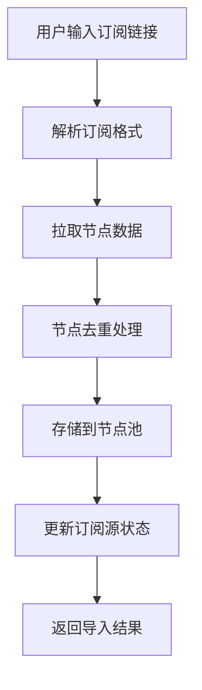
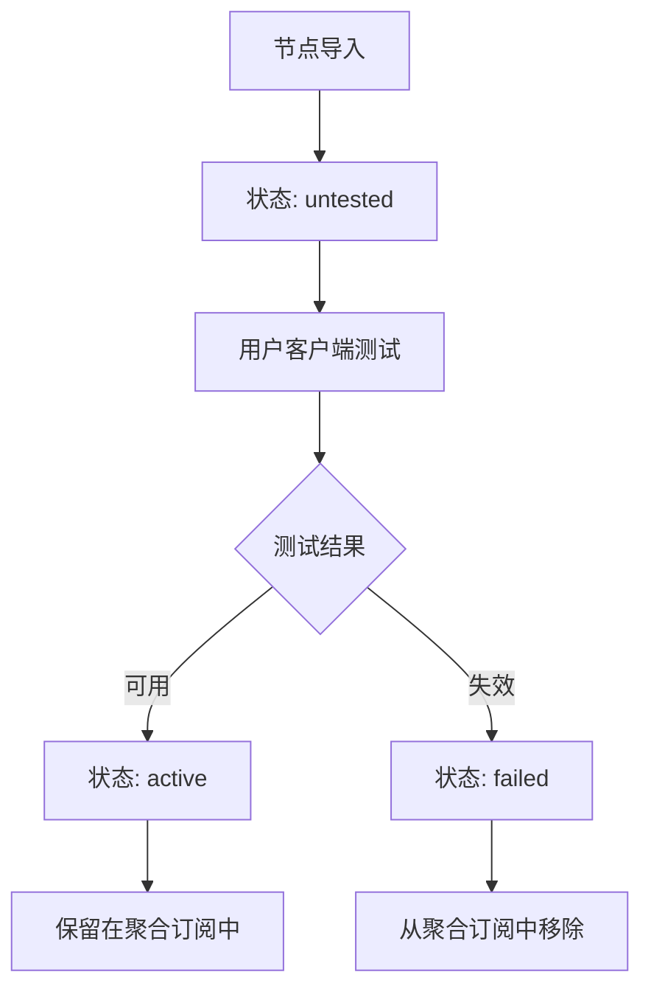
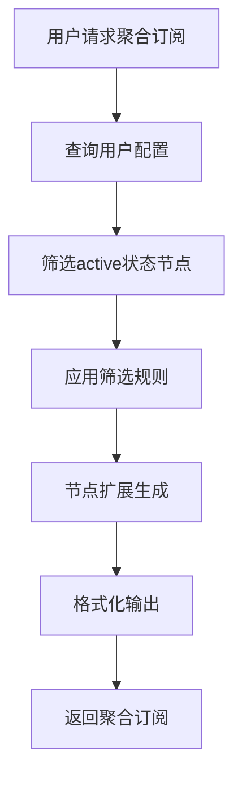

# 订阅聚合管理平台 - 业务规划方案

## 🎯 产品定位与核心价值

### 产品定位
**一站式订阅聚合管理平台** - 解决用户多订阅源管理混乱、节点失效检测困难、手动维护成本高的痛点。

### 核心价值主张
- **聚合管理**：多个机场订阅统一管理，告别订阅链接满天飞
- **智能筛选**：自动/手动筛选可用节点，保持订阅清爽高效
- **一键更新**：客户端测试后一键回传可用节点，自动清理失效节点
- **灵活扩展**：基于筛选后的优质节点，智能生成扩展节点池

---

## 📊 用户痛点分析

### 当前用户面临的问题
1. **订阅源分散**：机场A、机场B、免费节点...订阅链接管理混乱
2. **节点质量参差不齐**：大量失效节点混杂，影响使用体验
3. **手动维护成本高**：需要逐个测试、手动删除失效节点
4. **客户端配置复杂**：多个订阅源需要分别配置和更新
5. **节点资源浪费**：优质节点无法充分利用和扩展

### 目标用户画像
- **重度代理用户**：需要稳定、多样化的节点资源
- **机场收集者**：订阅多个机场，需要统一管理
- **技术敏感用户**：对节点质量和连接稳定性要求较高
- **效率追求者**：希望减少手动维护工作，提升使用效率

---

## 🏗️ 系统架构设计

### 数据库设计

#### 1. 订阅源管理表 (subscription_sources)
```sql
CREATE TABLE subscription_sources (
    id INTEGER PRIMARY KEY AUTOINCREMENT,
    user_id INTEGER NOT NULL,
    source_name TEXT NOT NULL,           -- 机场名称 (用户自定义)
    source_url TEXT NOT NULL,            -- 原始订阅链接
    source_type TEXT DEFAULT 'external', -- external/builtin
    last_fetch_at DATETIME,              -- 最后拉取时间
    fetch_status TEXT DEFAULT 'pending', -- pending/success/failed
    node_count INTEGER DEFAULT 0,        -- 节点数量
    active_node_count INTEGER DEFAULT 0, -- 可用节点数量
    created_at DATETIME DEFAULT CURRENT_TIMESTAMP,
    updated_at DATETIME DEFAULT CURRENT_TIMESTAMP,
    FOREIGN KEY (user_id) REFERENCES users (id)
);
```

#### 2. 节点池表 (node_pool)
```sql
CREATE TABLE node_pool (
    id INTEGER PRIMARY KEY AUTOINCREMENT,
    user_id INTEGER NOT NULL,
    source_id INTEGER,                   -- 来源订阅ID
    node_url TEXT NOT NULL,              -- 完整节点链接
    node_name TEXT,                      -- 节点名称
    node_type TEXT,                      -- vless/vmess/trojan等
    server_address TEXT,                 -- 服务器地址
    server_port INTEGER,                 -- 端口
    node_hash TEXT UNIQUE,               -- 节点唯一标识(防重复)
    status TEXT DEFAULT 'untested',      -- untested/active/failed
    last_test_at DATETIME,               -- 最后测试时间
    test_result TEXT,                    -- 测试结果详情
    created_at DATETIME DEFAULT CURRENT_TIMESTAMP,
    updated_at DATETIME DEFAULT CURRENT_TIMESTAMP,
    FOREIGN KEY (user_id) REFERENCES users (id),
    FOREIGN KEY (source_id) REFERENCES subscription_sources (id)
);
```

#### 3. 用户订阅配置表 (user_subscription_config)
```sql
CREATE TABLE user_subscription_config (
    id INTEGER PRIMARY KEY AUTOINCREMENT,
    user_id INTEGER NOT NULL,
    config_name TEXT DEFAULT 'default',  -- 配置名称
    include_sources TEXT,                 -- JSON: 包含的订阅源ID列表
    node_filter_rules TEXT,              -- JSON: 节点筛选规则
    auto_update_enabled BOOLEAN DEFAULT true,
    last_generated_at DATETIME,
    created_at DATETIME DEFAULT CURRENT_TIMESTAMP,
    FOREIGN KEY (user_id) REFERENCES users (id)
);
```

---

## 🔄 核心业务流程

### 1. 订阅源导入流程


**技术实现要点：**
- 支持多种订阅格式：Base64、Clash、V2Ray等
- 智能解析节点信息：协议、地址、端口、加密方式
- 节点去重算法：基于服务器地址+端口+协议生成唯一hash
- 异步处理：大量节点导入采用后台任务处理

### 2. 节点状态管理流程


### 3. 聚合订阅生成流程


---

## 🎨 用户界面设计

### 1. 订阅源管理页面
```
┌─────────────────────────────────────────┐
│ 📡 我的订阅源                            │
├─────────────────────────────────────────┤
│ [+ 添加新订阅源]                         │
│                                         │
│ 🏢 机场A                    [🔄] [⚙️] [🗑️] │
│    └─ 节点: 45个 | 可用: 32个            │
│    └─ 最后更新: 2小时前                  │
│                                         │
│ 🏢 机场B                    [🔄] [⚙️] [🗑️] │
│    └─ 节点: 28个 | 可用: 15个            │
│    └─ 最后更新: 1天前                   │
│                                         │
│ 🆓 免费节点                  [🔄] [⚙️] [🗑️] │
│    └─ 节点: 12个 | 可用: 3个             │
│    └─ 最后更新: 3天前                   │
└─────────────────────────────────────────┘
```

### 2. 节点池管理页面
```
┌─────────────────────────────────────────┐
│ 🎯 节点池管理                            │
├─────────────────────────────────────────┤
│ 筛选: [全部▼] [机场A▼] [状态▼] [🔍搜索]    │
│                                         │
│ ✅ 香港-01 | 机场A | 延迟:45ms  [测试][删除] │
│ ✅ 美国-02 | 机场B | 延迟:120ms [测试][删除] │
│ ❌ 日本-03 | 机场A | 超时      [测试][删除] │
│ ⏳ 新加坡-04 | 机场B | 未测试   [测试][删除] │
│                                         │
│ [批量测试] [清理失效] [导出可用节点]       │
└─────────────────────────────────────────┘
```

### 3. 聚合订阅配置页面
```
┌─────────────────────────────────────────┐
│ ⚙️ 聚合订阅配置                          │
├─────────────────────────────────────────┤
│ 包含订阅源:                              │
│ ☑️ 机场A  ☑️ 机场B  ☐ 免费节点           │
│                                         │
│ 节点筛选规则:                            │
│ ☑️ 仅包含可用节点                        │
│ ☑️ 排除高延迟节点 (>500ms)               │
│ ☑️ 地区偏好: [香港] [美国] [日本]         │
│                                         │
│ 扩展设置:                               │
│ ☑️ 启用节点扩展 (基于可用节点生成更多)    │
│ 扩展倍数: [3倍▼]                        │
│                                         │
│ 🔗 您的聚合订阅链接:                     │
│ https://your-domain.com/sub/your-uuid   │
│ [📋 复制链接] [🔄 立即更新]              │
└─────────────────────────────────────────┘
```

---

## 🔧 核心功能模块

### 1. 订阅源管理模块
**功能清单：**
- ✅ 添加外部订阅源（支持多种格式）
- ✅ 订阅源重命名和分类管理
- ✅ 定时/手动拉取订阅更新
- ✅ 订阅源健康状态监控
- ✅ 节点数量和可用性统计

**API设计：**
```javascript
POST /api/subscription-sources     // 添加订阅源
GET  /api/subscription-sources     // 获取订阅源列表
PUT  /api/subscription-sources/:id // 更新订阅源
DELETE /api/subscription-sources/:id // 删除订阅源
POST /api/subscription-sources/:id/refresh // 手动刷新
```

### 2. 节点池管理模块
**功能清单：**
- ✅ 节点自动去重和分类
- ✅ 节点状态跟踪（可用/失效/未测试）
- ✅ 批量节点测试和状态更新
- ✅ 节点搜索和筛选
- ✅ 失效节点自动清理

**关键算法：**
```javascript
// 节点去重算法
function generateNodeHash(nodeConfig) {
    const key = `${nodeConfig.protocol}://${nodeConfig.server}:${nodeConfig.port}/${nodeConfig.uuid}`;
    return crypto.createHash('md5').update(key).digest('hex');
}

// 节点状态更新算法
function updateNodeStatus(userFeedback) {
    // 用户从客户端反馈的可用节点列表
    const activeNodes = parseUserFeedback(userFeedback);
    
    // 标记反馈中的节点为可用
    markNodesAsActive(activeNodes);
    
    // 其他节点标记为失效（可配置策略）
    markOtherNodesAsFailed(activeNodes);
}
```

### 3. 智能聚合模块
**功能清单：**
- ✅ 多订阅源节点聚合
- ✅ 智能节点筛选和排序
- ✅ 节点扩展生成（基于优质节点）
- ✅ 多格式输出支持
- ✅ 实时订阅更新

**节点扩展策略：**
```javascript
// 节点扩展算法
function expandNodes(baseNodes, multiplier = 3) {
    const expandedNodes = [];
    
    baseNodes.forEach(node => {
        // 基于原节点生成扩展节点
        for (let i = 0; i < multiplier; i++) {
            const expandedNode = {
                ...node,
                server: getRandomIPFromCIDR(node.serverCIDR),
                port: getRandomPort(),
                name: `${node.name}_扩展${i+1}`
            };
            expandedNodes.push(expandedNode);
        }
    });
    
    return expandedNodes;
}
```

### 4. 用户反馈模块
**功能清单：**
- ✅ 客户端测试结果一键导入
- ✅ 节点可用性实时更新
- ✅ 失效节点自动移除
- ✅ 测试历史记录和分析

**用户操作流程：**
1. 用户在客户端（v2rayN等）导入聚合订阅
2. 客户端自动测试所有节点延迟和可用性
3. 用户选择可用节点，导出到剪贴板
4. 用户在平台"节点反馈"页面粘贴测试结果
5. 系统自动解析并更新节点状态
6. 聚合订阅实时更新，移除失效节点

---

## 📈 商业模式与增值服务

### 免费版功能
- ✅ 最多3个订阅源
- ✅ 节点池容量500个
- ✅ 基础聚合功能
- ✅ 手动节点状态更新

### 高级版功能 (付费)
- 🚀 无限订阅源
- 🚀 无限节点池容量
- 🚀 自动节点健康检测
- 🚀 智能节点推荐
- 🚀 API接口访问
- 🚀 数据导出功能

### 企业版功能
- 🏢 团队协作功能
- 🏢 企业级节点管理
- 🏢 自定义域名
- 🏢 专属技术支持

---

## 🛣️ 开发路线图

### Phase 1: 核心功能 (4-6周)
- [ ] 用户系统完善
- [ ] 订阅源管理基础功能
- [ ] 节点池管理系统
- [ ] 基础聚合订阅生成

### Phase 2: 智能化 (3-4周)
- [ ] 节点状态管理
- [ ] 用户反馈系统
- [ ] 智能筛选算法
- [ ] 节点扩展功能

### Phase 3: 用户体验优化 (2-3周)
- [ ] 前端界面美化
- [ ] 实时状态更新
- [ ] 批量操作功能
- [ ] 移动端适配

### Phase 4: 高级功能 (3-4周)
- [ ] 自动节点检测
- [ ] 数据分析面板
- [ ] API接口开发
- [ ] 付费功能实现

---

## 🎯 成功指标 (KPIs)

### 用户指标
- **用户注册数**：目标1000+活跃用户
- **订阅源数量**：平均每用户管理3-5个订阅源
- **节点池规模**：平均每用户维护100-300个节点
- **用户留存率**：月留存率>60%

### 产品指标
- **节点可用率**：聚合订阅节点可用率>80%
- **更新频率**：用户平均每周更新2-3次
- **反馈率**：用户节点反馈参与率>40%
- **扩展效果**：扩展节点可用率>70%

### 技术指标
- **系统可用性**：99.5%+
- **响应时间**：API响应<500ms
- **数据准确性**：节点状态准确率>95%

---

## 🔒 风险评估与应对

### 技术风险
- **风险**：大量订阅源拉取可能导致性能问题
- **应对**：异步队列处理，限流机制，缓存优化

### 合规风险
- **风险**：代理服务相关的法律合规问题
- **应对**：明确服务定位为"技术工具"，用户自负责任

### 竞争风险
- **风险**：类似产品出现，功能被复制
- **应对**：持续创新，建立用户粘性，开源社区建设

---

## 💡 创新亮点

1. **智能节点扩展**：基于优质节点自动生成更多可用节点
2. **用户反馈闭环**：客户端测试结果直接反馈到平台
3. **多源聚合**：统一管理多个机场和免费节点源
4. **实时状态同步**：节点状态实时更新，保持订阅清爽
5. **灵活配置**：用户可自定义筛选规则和扩展策略

---

## 🚀 下一步行动计划

1. **技术验证**：先实现核心的订阅解析和节点管理功能
2. **用户调研**：收集目标用户的具体需求和使用习惯
3. **MVP开发**：开发最小可行产品，验证核心价值假设
4. **用户测试**：邀请种子用户测试并收集反馈
5. **迭代优化**：基于用户反馈持续改进产品功能

---

*本方案基于对机场运营和用户需求的深度理解，旨在打造一个真正解决用户痛点的订阅聚合管理平台。*